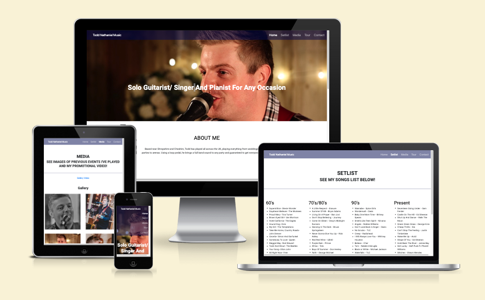

# Todd Nathaniel Music

Todd Nathaniel Music website is a responsive website that provides the user with information about a musician, to be able to see and hear what they perform and how to contact them to book them for a potential booking.

[View Todd Nathaniel Music Github pages](https://github.com/toddnedwards/todd-nathaniel-music.git "View Todd Nathaniel Music Github pages")

## Contents

- [Todd Nathaniel Music](#todd-nathaniel-music)
  - [Contents](#contents)
    - [Initial Discussion](#initial-discussion)
      - [Key information for the site](#key-information-for-the-site)
  - [User Stories](#user-stories)
    - [Client Goals](#client-goals)
    - [First Time Visitor Goals](#first-time-visitor-goals)
    - [Returning Visitor Goals](#returning-visitor-goals)
    - [Frequent Visitor Goals](#frequent-visitor-goals)
  - [Design](#design)
    - [Colour Scheme](#colour-scheme)
    - [Typography](#typography)
    - [Imagery](#imagery)
    - [Wireframes](#wireframes)
  - [Features](#features)
    - [General Features On Each Page](#general-features-on-each-page)
      - [Home](#home)
      - [Setlist](#setlist)
      - [Media](#media)
      - [Tour](#tour)
      - [Contact](#contact)
    - [Future Implementations](#future-implementations)
  - [Technologies Used](#technologies-used)
    - [Languages Used](#languages-used)
    - [Frameworks, Libraries and Programs Used](#frameworks-libraries-and-programs-used)
  - [Deployment And Local Development](#deployment-and-local-development)
    - [Deployment](#deployment)
    - [Local Development](#local-development)
      - [How To Fork](#how-to-fork)
      - [How To Clone](#how-to-clone)
  - [Testing](#testing)
  - [Credits](#credits)
    - [Code Used](#code-used)
    - [Conte](#conte)
    - [Media](#media-1)
    - [Acknowledgments](#acknowledgments)

### Initial Discussion

Todd Nathaniel Music is a musician page for a solo musician to showcase themselves to potential clients such as venues, parties or brides/grooms for weddings, and bring more awareness what they can supply for the client in terms of what songs they have available in their repertoire, videos that they can watch of the artist performing, upcoming dates so potential clients can go and watch the artist and be aware of their performances.
This could potentially save the client time by seeing questions answered on the website also such as "what to expect on the day", "how long do you play for" and "what are your prices" etc. It could also save the musician time by referring possible clients to the website so they can see all information clearly laid out with all the information needed to book them for event, rather than sending potential clients information over every time.

#### Key information for the site

- About the artist/ Who is the artist
- What does the artist play. In this instance, the artist plays guitar, piano and sings
- What songs does the artist perform
- Key points on why to book such as PLI certificated, quick setup time, good communications, has own equipment.
- Reviews from past clients to show the artists capabilities.
- Upcoming performance dates.
- Media including Videos and gallery of the artist
- Contact form for potential clients to enquire about services and other related questions

## User Stories

### Client Goals

- To be able to view the site on a range of device sizes.
- To make it clearly visible for potential clients to see and hear the artist.
- To make it easy for potential clients to contact the artist directly for booking enquiries.
- To allow people to see reviews of the artist so they can see past feedback to help with their decision of possible booking the artist for their own event.
- To allow people to visit social media pages also from the site with icons.

### First Time Visitor Goals

- To find out who Todd Nathaniel is and what they do as a musician.
- To navigate easily through the site with simple laid out titles.
- Be able to find social media links.
- Be able to message the artist directly to book or see a phone number provided to call.

### Returning Visitor Goals

- Be able to see up to date performance dates as they are announced.
- Be able to contact the artist easily.
- Be able to see new content via gallery and media.

### Frequent Visitor Goals

- Be able to see new songs being uploaded and new performance dates added.

## Design

### Colour Scheme

The website uses bright and light colours using HEX numbers for more variety, and also RGB (1, 1, 90) as I wanted to add opacity to certain areas such as the header section (0.8 opacity) with this I later decided that some text was not clear enough with the opacity from the navigation bar which needed to be clear to viewers at all times, but I didn't want to change the colour scheme, so instead simply set the opacity to 1 instead of 0.8. Button hovering i used 0.5 opacity, horizontal rule 0.5 opacity and the .timeline:after dots 0.8 opacity to keep the style continuous to the header colour. I chose this palette to keep the website fun and vibrant so it stands out and attracts potential clients. The #000000 black will be used for text, as well as #ffffff white for coloured background sections such as the hero image text and the "why book me?" section to make it stand out more compared to black text and to also break up the page. The #FF7E33 orange is used for the background colour on the "why book me" section, the #FF0634 red will be used for the "why book me?" icons to make them stand out against the orange background. The #87B7FF light blue will be used for buttons and navigation background areas (pre hover) It will also be used as the static colour for the social media icons. The colour palette was created using the Coolors website.

For the HEX codes for the social media hover states, I used google to find out the HEX colours to match the social media"s colours of their logos. These are the colours that google suggested:

Facebook logo: #3b5998
Instagram logo (purple colour from the instagram logo): #962fbf
Youtube logo: #c4302b

### Typography

Google Fonts was used for the following fonts:

- Roboto is used for headings on the site. For all headings I am using the weight of 700. I"ll be using sans-serif as a fallback text incase of any errors with loading google fonts.
- Roboto is also used for the body text on the site. I"ll be using the weight of 300 for paragraph text and for "why book me" section a weight of 400. I"ll be using sans-serif as a fallback text incase of any errors with loading google fonts.

### Imagery

All pictures have permission to be used and are owned by myself. I have obtained all rights to the photos and do not need permission from the photographers and media.
The imagery will be images of the performer in different scenarios so potential clients can get a good sense of picturing the performer at their own event.

### Wireframes

Wireframes we're creating using balsamiq.

#### Home Page

#### Setlist Page

#### Media Page

#### Tour Page

#### Contact Page

## Features

### General Features On Each Page

All pages feature a fixed header navigation bar area so it can be easily accessible at all times throughout scrolling through the website. All pages also have a footer section containing cookie/ privacy policy link which will link to a PDF file. The privacy policy was created using <https://www.privacypolicygenerator.info/>. The footer also contains social media links which will be anchored hyperlinks for each social media platform. Each page also has a favicon in the top browser.
This website is made up of the following pages:

#### Home

This page is an introduction. It begins with a hero image showing a guitarist playing, with the H2 heading "Solo guitarist/ singer and pianist for all occasions" to explain straight away what the purpose of the business is. It also includes an about me section showing past experience and places performed etc. This is followed by a "why book me?" section. This section includes a middle image on desktop version, surrounded by 4 points of why to book me with icons to represent each point. The icons will be provided from font awesome. This will explain what potential clients can expect from the services they"re enquiring about. The last section includes reviews from past clients to give potential clients a better idea of what to expect from the services they enquire about.

#### Setlist

This page includes 4 categories of songs that I typically play. These are categorised into 60"s, 70/80"s, 90"s and present. I found this to be accessible than having a long list of songs. This also responsive and collapses down to a row of two in tablet breakpoint and to one row on phone view. This was done using bootstrap columns. This page also includes a downloadable PDF with a larger list of songs so the main page is not overwhelmed with large lists.

#### Media

The media page includes 4 gallery images at the top of the page. These are also responsive using bootstrap columns, and collapse down to 2 images per row in tablet breakpoint and down to one image per row in mobile view. At the bottom of the page, it also includes a promotional video. I found with the images this was hidden slightly and may stop the user from scrolling down and seeing it, so I included a link section at the top of the page which scrolls down to the targets of images and video.

#### Tour

The tour page includes 3 columns of dates using a history timeline as shown in the resume project. This shows dates of performances throughout 3 months. Two dates also include links where you can buy tickets for the events.

#### Contact

The contact page includes a contact form so potential clients can enquire or send a general message. Depending on their preference of contact, I also included a table with phone number and email address link too.

### Future Implementations

In the future, I would like to add extra pages such as "Music" where original music can be displayed with links to streaming platforms such as apple music, Spotify, and amazon music. Another great feature would be to offer a "book a call" using an embed service which would allow potential clients to book a time to discuss what could be offered for event and any further questions they have.

## Technologies Used

### Languages Used

HTML and CSS we're used as the main languages, along with the bootstrap javascript to enable the mobile navigation menu.

### Frameworks, Libraries and Programs Used

Balsamiq- Used to create Wireframes

Gihub- To save and store files for the website

Bootstrap 4.5.3- For styling, including navigation bar, why book me section on index.html, setlist.html columns, media gallery columns and video centre alignment, footer alignment. CSS was used for all other styling.

Google Fonts- To import and use the fonts used on the website.

Google Dev Tools- To inspect coding and find potential problems in coding. To view website responsiveness on other devices.

<https://ui.dev/amiresponsive> - To show website responsiveness on different devices.

Coolor- To create the colour chart for website colours

Image Tools+ - To size all images including favicon.

<https://www.privacypolicygenerator.info/> - For creating a privacy pollicy for the website.

Shields.io- To add badges to the README file.

## Deployment And Local Development

### Deployment

The site is deployed using Github pages- <https://toddnedwards.github.io/todd-nathaniel-music/>

### Local Development

#### How To Fork

To fork the depository:

1. Log in or sign up to <https://github.com/>
2. Go to the repository for this project <https://github.com/toddnedwards/todd-nathaniel-music>
3. Click the fork button in the top right corner

#### How To Clone

1. Log in or sign up to <https://github.com/>
2. Go to the repository for this project <https://github.com/toddnedwards/todd-nathaniel-music>
3. Click the code button, select whether you'd like to clone with HTTPS, SSH or GitHub CLI and copy the link shown.
4. Open the terminal in your code editor and change the current working directory to the location you want to use for the cloned directory.
5. Type 'Git Clone' into the terminal and then paste the link you copied in step 3. Press Enter.

## Testing

[View TESTING.md page](/TESTING.md "View TESTING.md page")

## Credits

### Code Used

For flex box coding, I used <https://philipwalton.github.io/solved-by-flexbox/demos/sticky-footer/> to solve my footer not being fixed to the bottom of the page.

### Content

All information provided was written by myself. All reviews are real reviews that I have received. All dates and tour dates links are also genuine, along with the social media links that link to my social media pages.

### Media

All media used is from my own personal material that I use for promotional purposes.

### Acknowledgments

I'd like to acknowledge the following people for helping me build this website.

- Kera Cudmore for creating a great README.md example <https://docs.google.com/presentation/d/19_7r_To5bu7UjnZD87hrzWQi63Ij0YpaRH1XFnPZZe8/edit#slide=id.g1551aff15c5_1_96> that I have followed to create this README.md file.
- For people in the slack community who are always there to help with coding queries that I have had.
- For my mentor, Adegbenga for guiding me through issues I had with my site such as the footer section and breakpoints, and helping improve elements of the site to make it more user friendly.

<https://docs.google.com/presentation/d/19_7r_To5bu7UjnZD87hrzWQi63Ij0YpaRH1XFnPZZe8/edit#slide=id.g1551aff15c5_1_0>

I used this mark up cheat sheet that I found on the slack community for clear guidance on how to create layouts for this readme file:

<https://github.com/tchapi/markdown-cheatsheet/blob/master/README.md>

Shields.io badges we’re created for readme.md file using the markup code from:
<https://shields.io/badges>

The use of the coolors website for the colours graph was provided from <https://github.com/kera-cudmore/Bully-Book-Club#user-experience-ux>

I used this page to find different breakpoints to make certain page elements more responsive to different devices: <https://www.w3schools.com/howto/howto_css_media_query_breakpoints.asp>

I realised this didn’t support smaller devices less than 600px so I googled what was the suggested @media size for small phones which google suggested as

To help me choose the colours I liked for my project and to see different varieties for HEX and RGBA, I used: <https://htmlcolorcodes.com/color-picker/>
