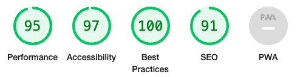

# Testing Documentation

## Contents

- [Automated Testing]{#automated-testing}
  - [W3c Validator]{#W3c-validator}
  - [Lighthouse]{#Lighthouse}
- [Manual Testing]{#manual-testing}
  - [Testing User Stories]{#testing-user-stories}
  - [Full Testing]{#full-testing}
- [Bugs]{#bugs}
  - [Known Bugs]{#known-bugs}
  - [Solved Bugs]{#solved-bugs}

---

## Automated Testing

### W3C Validator

W3C Validator was used to validate all HTML and CSS across the website.

The following errors we're shown and fixed.

index.html-
Error: Stray end tag div. From line 104, column 9; to line 104, column 14 (fixed by removing /div element from end)
Error: End tag section seen, but there were open elements. From line 169, column 5; to line 169, column 14 (fixed by adding /div element)
Error: Unclosed element div. From line 112, column 9; to line 112, column 31 (fixed by adding /div element)

setlist.html-
Error: End tag h3 seen, but there were open elements. From line 144, column 88; to line 144, column 92 (started with h3 and ended with h4 element, been changed to h4 element and h4 close element)
Error: Stray end tag div. From line 146, column 9; to line 146, column 14 (Removed extra /div element)

Media.html-
Error: No p element in scope but a p end tag seen. From line 55, column 13; to line 55, column 16 (/p element removed)
Error: Bad value 80% for attribute width on element video: Expected a digit but saw % instead. From line 90, column 17; to line 90, column 57 (removed video height and width percentage from html and created a class for the video instead with a max width of 80% and height auto)
Error: Bad value 80% for attribute height on element video: Expected a digit but saw % instead.. From line 90, column 17; to line 90, column 57 (removed video height and width percentage from html and created a class for the video instead with a max width of 80% and height auto)

setlist.html-
Error: End tag h3 seen, but there were open elements. From line 144, column 88; to line 144, column 92 (code started with h3 tag but ended with h4. both changed to h4 tags)
Error: Stray end tag div. From line 146, column 9; to line 146, column 14 (deleted stray tag)
Error: Stray end tag div.

Tour.html-
Error: From line 127, column 13; to line 127, column 18 (removed stray tag)
Error: End tag for body seen, but there were unclosed elements. From line 150, column 1; to line 150, column 7 (add /section element to line 46)
Error: Unclosed element section. From line 46, column 5; to line 46, column 13 (problem solved by above solutions adding /section element to line 45)

Contact.html-

### Lighthouse

### Desktop Results

- Index Page

- Setlist Page

- Media Page

- Tour Page

- Contact Page

### Mobile Results

- Index Page

- Setlist Page

- Media Page

- Tour Page

- Contact Page

---

## Manual Testing

### Testing User Stories

### Full Testing
