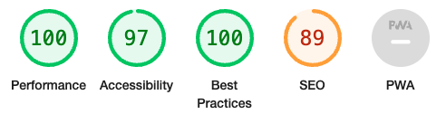
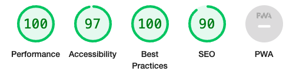
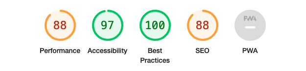
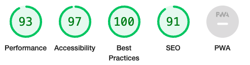

# Testing Documentation

## Contents

- [Automated Testing](#automated-testing)
  - [W3c Validator](#W3c-validator)
  - [Lighthouse](#Lighthouse)
- [Manual Testing](#manual-testing)
  - [Testing User Stories](#testing-user-stories)
  - [Full Testing](#full-testing)
- [Bugs](#bugs)

---

## Automated Testing

### W3C Validator

W3C Validator was used to validate all HTML and CSS across the website.

The following errors we're shown and fixed.

index.html-
Error: Stray end tag div. From line 104, column 9; to line 104, column 14 (fixed by removing /div element from end)
Error: End tag section seen, but there were open elements. From line 169, column 5; to line 169, column 14 (fixed by adding /div element)
Error: Unclosed element div. From line 112, column 9; to line 112, column 31 (fixed by adding /div element)

setlist.html-
Error: End tag h3 seen, but there were open elements. From line 144, column 88; to line 144, column 92 (started with h3 and ended with h4 element, been changed to h4 element and h4 close element)
Error: Stray end tag div. From line 146, column 9; to line 146, column 14 (Removed extra /div element)

Media.html-
Error: No p element in scope but a p end tag seen. From line 55, column 13; to line 55, column 16 (/p element removed)
Error: Bad value 80% for attribute width on element video: Expected a digit but saw % instead. From line 90, column 17; to line 90, column 57 (removed video height and width percentage from html and created a class for the video instead with a max width of 80% and height auto)
Error: Bad value 80% for attribute height on element video: Expected a digit but saw % instead.. From line 90, column 17; to line 90, column 57 (removed video height and width percentage from html and created a class for the video instead with a max width of 80% and height auto)

setlist.html-
Error: End tag h3 seen, but there were open elements. From line 144, column 88; to line 144, column 92 (code started with h3 tag but ended with h4. both changed to h4 tags)
Error: Stray end tag div. From line 146, column 9; to line 146, column 14 (deleted stray tag)
Error: Stray end tag div.

Tour.html-
Error: From line 127, column 13; to line 127, column 18 (removed stray tag)
Error: End tag for body seen, but there were unclosed elements. From line 150, column 1; to line 150, column 7 (add /section element to line 46)
Error: Unclosed element section. From line 46, column 5; to line 46, column 13 (problem solved by above solutions adding /section element to line 45)

Contact.html-

### Lighthouse

### Desktop Results

- Index Page

- Setlist Page

- Media Page

- Tour Page

- Contact Page

### Mobile Results

- Index Page

- Setlist Page

- Media Page

- Tour Page

- Contact Page

### Axe Dev Tools

I used axe dev tools to see if further errors we're found on my pages.

- Index Page
I found on the index page that there was an error for sufficient contrast ratio. I fixed this by changing all text in the "why book me?" section from white to black. 
I also found that my headers we're not in order for using h1, h2, h3 etc, so I changed the header title to H1 and the about me section to h2. This fixed the problems and still worked well with the sizings for the page so no further styling elements we're needed.

No other errors we're found on other pages.

---

## Manual Testing

### Testing User Stories

The most common path to navigate through the website is:
Home > Setlist > Media > Tour > Contact

These are the order they are placed in the navigation bar and are accessible from each page.

Each page is important to a potential client booking the musician as they need to know about the musician from the home page, what songs they play from the setlist, want to see and hear the artist from the media page. If they like this information but would like to see a performance, they may look at tour dates to come and see the artist. If they they want to directly enquire after that or simply message instead with an enquiry they can go straight to contact page. 

#### Testing client stories from UX section of README.md

##### Client Goals

1. To be able to view the site on a range of device sizes.

Each page has breakpoints set up for client visibility to be optimised. I used bootstrap columns too for breakpoints to make information clearer. I also hid the image in the "why book me?" section on the index page as this was unneccessary for phone and tablet screens and took up more space, taking attention away from further information that the client needs to know.
I used bootstrap also for the navigation bar on smaller devices to make it more user friendly for smaller devices.

2. To make it clearly visible for potential clients to see and hear the artist.

This is provided by the hero image on the first index page, seeing and image of the artist. The media page also provides a video and 4 images of the artist so clients can see them.

3. To make it easy for potential clients to contact the artist directly for booking enquiries.

This is provided by the contact page, where they can leave their details for booking enquiries. There is also a phone number and email address set up on the contact page if they prefer that contact method. On each page, social media links are provided in the footer section if clients would like to find out further information and make contact with the artist through social media as well.

4. To allow people to see reviews of the artist so they can see past feedback to help with their decision of possible booking the artist for their own event.

Reviews are provided on the index.html page underneath the "why book me?" section, titled "reviews". These also use bootstrap to collapse into one row when on smaller devices to make all text clear to read for the client.

5. To allow people to visit social media pages also from the site with icons.

Social media links are provided on the footer section of every page. They also utilise the '_blank' element to open the social media link in a new page to not take the attention away from the website.

##### First Time Visitor Goals

1. To find out who Todd Nathaniel is and what they do as a musician.

This information is provided on index.html with a hero image to show what Todd Nathaniel looks like, followed by an about me section with a short description. This is then followed with "why book me" to provide information on what clients can expect, and reviews so clients can see what other clients have said about the artist to get a clearer idea of their performances.

2. To navigate easily through the site with simple laid out titles.

These are provided in the navigation section clearly. In mobile view these become a hamburger style dropdown menu which is expected of most websites on mobile devices to make it clearer for users.

3. Be able to find social media links.

All social media links are provided in the footer section.

4. Be able to message the artist directly to book or see a phone number provided to call.

A contact form is provided on the contact.html page, as well as a phone number and email address to contact.

##### Returning Visitor Goals

1. Be able to see up to date performance dates as they are announced.

Tour dates are provided on the tour.html page as well as hyperlinks provided to events where tickets can be bought externally.

2. Be able to contact the artist easily.

Contact form, phone number and email address provided on the contact.html page as well as social media links in footer section.

3. Be able to see new content via gallery and media.

All content is provided in this section, including 4 images and 1 promotional video.

##### Frequent Visitor Goals

1. Be able to see new songs being uploaded and new performance dates added.

New songs, videos and images can be uploaded directly to the media.html section in the future.

### Full Testing

Full testing was performed on the following devices:

Laptop: Macbook Pro 2018 16 inch screen
        Imac 2019 27 inch screen

Mobile Devices:
Samsung Galaxy S21
Ipad air 2017

Each device tested the site using the following browsers:

Google Chrome
Safari
Internet (android)
Microsoft Edge

Additional testing was provided by friends and family that I sent the website too, who reported no issues or errors with the site.

#### Navigation Bar:

- Be responsive on all devices: Passed (Navigation bar resizes with devices and collapses to hamburger style dropdown navigation on mobile devices)
- Left corner logo text "Todd Nathaniel Music" when clicked navigates to index.html: Passed on all pages.
- Navigation links navigate correctly to the corresponding pages: Passed On All Pages.

#### Footer

- Be responsive on all devices: Passed on all devices (social media links resize with breakpoints to stay in proportion to screen. Privacy policy hyperlink on left hand resizes on smaller devices to no longer have right margin of 5px)
- Privacy Policy hyperlink works correctly: Passed on all devices (follows to PDF document on all pages)

#### Home Page

- H1 title is overlayed on hero image at top of screen: Passed (H1 title is responsive with breakpoints over the hero image and padding is added of 5 px to left and right to stop text being lost to sides on smaller devices)
- About me section stays central: Passed (Used text-center bootstrap element to keep central at all times on all devices)
- Why book me section collapses to 12 width columns on devices smaller than desktops and hides central image: Passed (Bootstrap element used for each section to expand on smaller breakpoints, and CSS added to text-align all text to center)
- Reviews are responsive: Passed (3 reviews are viewed at the top and 2 underneath on desktop view. This was created with bootstrap using 4 width columns with than offset on the bottom row. These become 12 column width for each review on smaller devices with offset removed)

#### Set list

- Provide four columns on desktop view: Passed (Created using 4x 3 width columns with bootstrap element)
- Provide two columns to create a grid on tablet view: Passed (Created using 2x 6 width columns with bootstrap, which causes the last two setlist lists to appear underneath instead creating the grid)
- Provide lists of songs that are played: Passed (Created using ul and li html elements to create lists)

#### Media

- Provide two links at the top of the page to move to # targets: Passed (Both links work to target gallery and video. These links we're created so users we're aware that there was a video underneath the images and make it more accessible)
- Responsive images at top of page: Passed (Row of 4 images provided on desktop, collapsing to 2 images per row on tablet and 1 image per row on smaller devices. All created using bootstrap elements.)
- Responsive video size: Passed (Using responsive-video element)

#### Tour

- Provide Tour Dates: Passed (3 columns showing monthly dates in a row)
- Links working to click on external ticket purchases: Passed (Both links on two events working correctly and using '_blank' to not take attention away from main site)

#### Contact

- Contact form is useable: Passed (Information is allowed to be inputted into all boxes and send button is able to be pressed)
- Link to email address externally redirects to users default mail app: Passed
- Contact form is responsive: Passed

## Bugs 

All bugs are described throughout the readme.md document.
